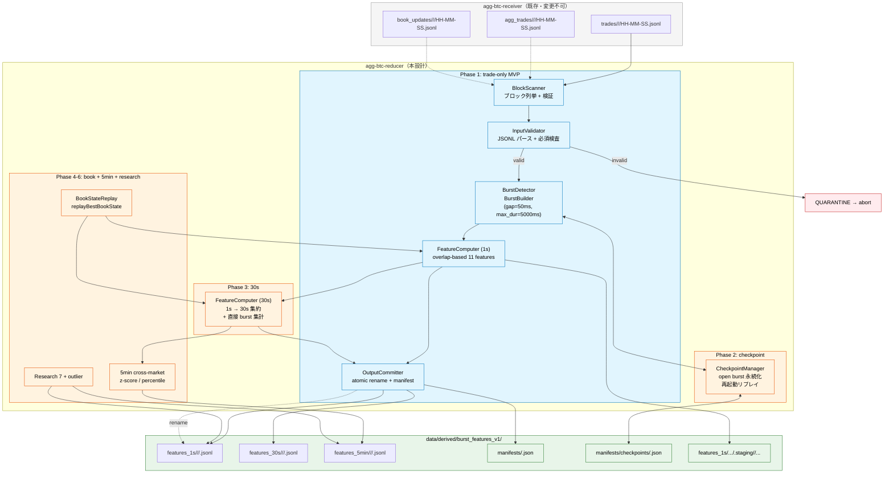

# バースト特徴量レデューサー アーキテクチャ設計書

**文書 ID:** design-2026-07-10-burst-reducer
**日付:** 2026-07-10
**対象リポジトリ:** `agg-btc-receiver`（`/home/weed420/dev/github/like-kradness-2025/agg-btc-receiver`）
**スコープ:** BTC 全15マーケットの downstream burst 特徴量 pipeline（reducer）
**依存仕様:** `docs/specs/specify-2026-07-09-burst-features.md`（22特徴量定義。本設計書は重複しない。節番号で参照する。）

---

## 目次

1. [コンテキストと境界](#1-コンテキストと境界)
2. [コンポーネントアーキテクチャ](#2-コンポーネントアーキテクチャ)
3. [正規パス仕様](#3-正規パス仕様)
4. [入出力スキーマエンベロープ](#4-入出力スキーマエンベロープ)
5. [状態機械](#5-状態機械)
6. [状態永続化と再起動ルール](#6-状態永続化と再起動ルール)
7. [順序・ウォーターマークセマンティクス](#7-順序ウォーターマークセマンティクス)
8. [エラー分類](#8-エラー分類)
9. [障害・復旧テーブル](#9-障害復旧テーブル)
10. [可観測性・マニフェスト](#10-可観測性マニフェスト)
11. [フェーズ境界（P0-P6）](#11-フェーズ境界p0-p6)
12. [受入基準](#12-受入基準)
13. [アーキテクチャ図（Mermaid）](#13-アーキテクチャ図mermaid)

---

## 1. コンテキストと境界

### 1.1 システム境界

```
┌─────────────────────────────────────────────────────┐
│  agg-btc-receiver（既存・変更不可）                   │
│  責務: WebSocket受信 + 30秒ブロック保存               │
│  出力: data/live_v3/{trades,agg_trades,book_updates}/ │
└──────────────────┬──────────────────────────────────┘
                   │ 30秒ブロック (.jsonl, 00/30秒境界)
                   ▼
┌─────────────────────────────────────────────────────┐
│  agg-btc-reducer（本設計の対象 = 新規実装）           │
│  責務: すべての downstream aggregation               │
│  出力: data/derived/burst_features_v1/...             │
└─────────────────────────────────────────────────────┘
```

**絶対ルール:**
- Receiver のソースコードに一切変更を加えない。
- 生ブロック（`data/live_v3/`）を Phase 1 で削除しない。クリーンアップは後の別フェーズ。
- 新データセットは `data/derived/burst_features_v1/` に完全分離。旧パス `data/burst_agg/`、`data/1s_features/` への書き込み禁止。

### 1.2 再利用ライブラリ

| ライブラリ | パス | 使用方法 |
|---|---|---|
| BurstBuilder | `lib/burst-builder.mjs` | バースト形成。パラメータ `gap_threshold_ms=50, max_burst_duration_ms=5000` でインスタンス化。`feedTrade()` による逐次投入後、`getClosedBurstsOverlapping(secondTs)` で 1s バケット重複判定。 |
| replayBestBookState | `lib/replay-book-state.mjs` | 板状態の時刻再現。book_updates イベント列をソート投入し、任意時刻の bestBid/bestAsk ルックアップ関数を得る。v1 Phase 1 では trade-only のため使用しないが、スキーマには NULL 許容で予約。 |

**非互換:**
- `scripts/burst-agg.mjs` の出力スキーマ（`data/burst_agg/`）は採用しない。新スキーマを独自定義する。

### 1.3 固定パラメータ

| パラメータ | 値 | 根拠 |
|---|---|---|
| `gap_threshold_ms` | `50` | 仕様 §10.2 |
| `max_burst_duration_ms` | `5000` | 仕様 §10.2 |
| `market_tick_size` | マーケット別マップ（下記） | 仕様 §4.3 注記参照 |
| ブロック間隔 | `30000` ms | Receiver の出力単位 |
| 1s バケット幅 | `1000` ms | |

**`market_tick_size` マップ（v1 必須）:**
BTC マーケットの実際の tick size は取引所ごとに異なる。`multilevel_burst_max_span_ticks_1s` の計算に必須のため、以下のマップをハードコードする。未定義マーケットでは当該列を `null` とする。`_span_bps_1s` 列は tick size 非依存のため、未定義マーケットでも計算可能。

| マーケット | tick_size |
|---|---|
| `binance_spot` | `0.01` |
| `binance_spot_usdc` | `0.01` |
| `binance_perp` | `0.01` |
| `binance_perp_btcusdc` | `0.01` |
| `bybit_perp` | `0.10` |
| `bybit_spot` | `0.01` |
| `okx_perp` | `0.10` |
| `okx_spot` | `0.10` |
| `coinbase_spot` | `0.01` |
| `kraken_spot` | `0.10` |
| `hyperliquid_perp` | `0.10` |
| `bitmex_perp` | `0.50` |
| `bitstamp_spot` | `0.01` |
| `crypto_com_spot` | `0.01` |
| `bitfinex_spot` | `0.01` |

v1 ではマーケット別上書き不可（マップはハードコード）。

---

## 2. コンポーネントアーキテクチャ

### 2.1 コンポーネント一覧

```
┌──────────────────────────────────────────────────────────────────┐
│  Reducer CLI エントリポイント                                      │
│  scripts/reduce-burst-v1.mjs                                     │
│  --from <ISO> --to <ISO> [--markets <csv>] [--dry-run]           │
└──────────────┬───────────────────────────────────────────────────┘
               │
       ┌───────┴───────┐
       ▼               ▼
┌──────────────┐ ┌──────────────────┐
│ BlockScanner │ │ ManifestManager  │
│ ブロック列挙  │ │ マニフェスト管理  │
│ + 検証        │ │ + 冪等性判定     │
└──────┬───────┘ └────────┬─────────┘
       │                  │
       ▼                  │
┌──────────────────┐      │
│ ReducerPipeline   │◄─────┘
│ ブロック単位処理   │
│                   │
│ ┌───────────────┐ │
│ │InputValidator │ │
│ │ 入力検証       │ │
│ └───────┬───────┘ │
│         ▼         │
│ ┌───────────────┐ │
│ │BurstDetector  │ │
│ │ burst-builder  │ │
│ └───────┬───────┘ │
│         ▼         │
│ ┌───────────────┐ │
│ │FeatureComputer│ │
│ │ 1s/30s 計算    │ │
│ └───────┬───────┘ │
│         ▼         │
│ ┌───────────────┐ │
│ │OutputCommitter│ │
│ │ atomic rename  │ │
│ └───────────────┘ │
└──────────────────┘
```

### 2.2 各コンポーネントの責務

#### BlockScanner
- `data/live_v3/trades/<market>/<YYYY-MM-DD>/<HH-MM-SS>.jsonl` を列挙
- UTC 絶対時刻でソート（ブロック開始時刻昇順）
- ファイル名が `00` または `30` 秒に揃っているか検査
- 未処理ブロックの判定：マニフェストの既処理ブロックID集合と照合

#### ManifestManager
- パス: `data/derived/burst_features_v1/manifests/<market>.json`
- 形式:
```json
{
  "schema_version": "burst_features_v1",
  "market": "binance_spot",
  "last_checkpoint_block_start": 1751821200000,
  "processed_blocks": {
    "burst_features_v1:binance_spot:1751821200000:abc123...": {
      "status": "committed",
      "input_sha256": "abc123...",
      "output_paths": {
        "features_1s": "features_1s/binance_spot/2026-07-10/00-00-00.jsonl"
      },
      "staged_row_hash": "def789...",
      "final_row_hash": "abc123...",
      "checkpoint_generation": 42,
      "commit_id": "550e8400-e29b-41d4-a716-446655440000",
      "committed_at": "2026-07-10T01:02:00.000Z"
    }
  }
}
```
- 冪等性キー: `schema_version + market + block_start + input_sha256`（`burst_features_v1:binance_spot:1751821200000:abc123...` 形式）
- 入力 SHA256 は `sha256(全行の連結バイト列)` で計算

#### InputValidator
- 各入力 `.jsonl` ファイルの行をパース
- 必須フィールド検査: `ts`, `side`, `price`, `qty`
- 値妥当性: `price > 0`, `qty > 0`, `side in {buy, sell}`
- 時系列単調性検査: ブロック内の ts が `[block_start, block_start + 30000)` かつ非減少（同一ts許可、減少は E004 quarantine/fail）
- **同一 ts:** 許可。comparator = `(ts, hasTradeId?0:1, normalizedTradeIdOrEmpty, source_file_line_index)`
- **E004 (ts decrease):** 正規化禁止。quarantine/fail → 異常終了
- **E006 (00/30 非境界):** skip+warn 禁止。quarantine/fail → 異常終了
- **無効入力時: quarantine にエラーreport を書き込む。raw は移動/削除しない。** checkpoint は進めない。後続ブロックの処理を継続しない = 即座に異常終了。

#### BurstDetector
- `BurstBuilder` インスタンスをマーケットごとに作成
- ブロック内 trades を安定ソート: `ts 昇順 → tradeId（存在すれば）→ ソースファイル行インデックス`
- `feedTrade()` で逐次投入
- **1-block lag commit:** ブロック N の trades をすべて投入した後も、N の 1s output をコミットしない。ブロック N+1 の全 trades を読み込み、全量 raw 検証 → finalized N の required aux（`[N_start-30000, N_end)` と交差する全 agg_trades ブロック）の存在・妥当性を検証 → N+1 全 trades 投入 → N 初回計算 → N 単一コミット、の順で処理する。
- ブロック N は **pending block** として RAM + checkpoint に保持。checkpoint には open burst state に加え、pending block の identity、staged row content hash（または再構成に必須の入力 hash）を保存する。
- N+1 全量の投入後に N-origin の全 burst が確定したら、N の row を finalize してコミットする。空 N+1 は watermark 例外として N の open burst が閉じた証明となる。
- **EOF 時のみ** `BurstBuilder.flushAll()` を呼び、最後の pending block を finalize する。
- 中間出力・事後再計算方式は禁止。N の行は N+1 の全 trades 投入後に初めて計算し、一度だけコミットする。

#### FeatureComputer
- **v1 Phase 1 trade-only MVP コア**（最小実装）:
  - `burst_count_1s`
  - `total_burst_notional_1s`
  - `max_burst_notional_1s`
  - `max_burst_prints_1s`
  - `max_burst_duration_ms_1s`
  - `buy_burst_notional_1s`
  - `sell_burst_notional_1s`
  - `burst_imbalance_ratio_1s`
  - `largest_burst_share_notional_1s`
  - `same_price_burst_count_1s`
  - `multilevel_burst_count_1s`
  - `burst_notional_vs_30s_traded_notional`（#12, agg_trades入力必須）
- 板依存フィールドは **P1 契約値**で出力: #13=`null` + `_quality.book_seeded=false`、#14=`0`（`null` ではない）。研究 #15-#22 は `0`。全22列が物理出力に存在する。
- 1s overlap ルール: 仕様 §2.3 の定義に従う（`burst_start_ts < bucket_end AND burst_end_ts >= bucket_start`）
- 30s 直接集計: overlap 合算不可のフィールドは 30s window 内の burst を直接集計（重複カウント回避）。出力名を仕様 §6.2 表に従い `_overlap_sum_30s` と `_sum_30s` で区別

#### OutputCommitter
- **5-step atomic commit protocol（順序厳守）:**
  1. **Stage rows + SHA256:** 出力行を final 同 filesystem の `.staging/<run_id>/` に書き込み、行内容 SHA256（`staged_row_hash`）を計算
  2. **Intent manifest:** `status: "intent"` の manifest を fsync + atomic rename
  3. **Final data shard:** staged file を本番パス（`features_1s/<market>/<YYYY-MM-DD>/<HH-MM-SS>.jsonl`）に atomic rename（重複書き込み禁止。staged ファイルがそのまま renamed）
  4. **Final checkpoint:** checkpoint を本番パスに atomic rename
  5. **Committed manifest:** `status: "committed"` に更新して atomic rename
- 出力は **block shard** 単位: `data/derived/burst_features_v1/features_1s/<market>/<YYYY-MM-DD>/<HH-MM-SS>.jsonl`（日次追記方式 禁止。HH-MM-SS は 00 または 30 秒のみ）
- composite idempotency key = `{schema_version}:{market}:{block_start_ms}:{input_sha256}`
- マニフェストのチェックポイント更新とデータコミットを論理ユニットとして扱う

---

## 3. 正規パス仕様

### 3.1 入力（Receiver 出力・読み取り専用）

```
data/live_v3/
  trades/<market>/<YYYY-MM-DD>/<HH-MM-SS>.jsonl       # HH-MM-SS は 00 または 30 秒のみ
  agg_trades/<market>/<YYYY-MM-DD>/<HH-MM-SS>.jsonl
  book_updates/<market>/<YYYY-MM-DD>/<HH-MM-SS>.jsonl
```

### 3.2 出力（Reducer 生成・新規）

```
data/derived/burst_features_v1/
  features_1s/<market>/<YYYY-MM-DD>/<HH-MM-SS>.jsonl     # block shard: 30行（1s×30）
  features_30s/<market>/<YYYY-MM-DD>/<HH-MM-SS>.jsonl    # block shard: 1行（30s window）
  features_5min/<market>/<YYYY-MM-DD>/<HH-MM-SS>.jsonl   # block shard（Phase 4以降）
  manifests/
    <market>.json                                         # マニフェスト（intent/committed status）
    checkpoints/
      <market>.json                                       # open burst + pending block チェックポイント
  features_1s/<market>/<YYYY-MM-DD>/.staging/<run_id>/<HH-MM-SS>.jsonl
  features_30s/<market>/<YYYY-MM-DD>/.staging/<run_id>/<HH-MM-SS>.jsonl
  quarantine/
    <market>/<block_start_ms>.json                        # エラーreport（rawは移動しない）
```

**block shard 命名規則:**
- ファイル名 = ブロック開始時刻 `HH-MM-SS`
- **1s/30s block shard:** HH-MM-SS は 00 または 30 秒のみ（Receiver の 30s ブロック境界と一致）
- 30s window: 絶対 UTC 時刻で 00/30 秒境界の 30s bucket。例: `00-00-00.jsonl` は `[HH:00:00, HH:00:30)` の window
- **5min block shard:** seconds=`00` かつ UTC minute が 5 の倍数（0,5,10,15,...,55）。00/30 秒制約は 1s/30s layer のみに適用され、5min layer には適用されない。例: `00-05-00.jsonl` は `[HH:05:00, HH:10:00)` の window（Phase 4以降）
- consumers は manifest index からブロック一覧を取得し、必要な shard を読み取る

**quarantine パス:**
- raw 入力ファイルは一切移動/削除しない
- エラー report のみを quarantine パスに書き込む
- checkpoint を進めない（再試行時に再処理される）

### 3.3 禁止パス

| パス | 理由 |
|---|---|
| `data/burst_agg/` | 旧 burst-agg.mjs 出力スキーマ。混在禁止 |
| `data/1s_features/` | 旧パス。混在禁止 |
| `data/derived/burst_features_v1/features/` | 旧仕様の非バージョン管理パス。`features_1s/` を使用 |

---

## 4. 入出力スキーマエンベロープ

### 4.1 入力 trade 行スキーマ

```typescript
// data/live_v3/trades/<market>/<YYYY-MM-DD>/<HH-MM-SS>.jsonl の各行
interface TradeInput {
  market: string;       // e.g. "binance_spot"
  price: number;        // > 0
  qty: number;          // > 0
  side: "buy" | "sell";
  ts: number;           // epoch ms
  tradeId?: string;     // optional, 安定ソートに使用
}
```

### 4.2 出力 features_1s 行スキーマ（v1 Phase 1 trade-only MVP）

```typescript
interface BurstFeature1sRow {
  // 識別
  ts: number;                    // 秒境界 epoch ms（ts % 1000 == 0）
  market: string;

  // ── trade-only コア（Phase 1 実装必須）──
  burst_count_1s: number;                   // uint16, ≥0
  total_burst_notional_1s: number;          // float64, ≥0
  max_burst_notional_1s: number;            // float64, ≥0
  max_burst_prints_1s: number;             // uint16, ≥0
  max_burst_duration_ms_1s: number;        // uint16, ≥0
  buy_burst_notional_1s: number;           // float64, ≥0
  sell_burst_notional_1s: number;          // float64, ≥0
  burst_imbalance_ratio_1s: number;        // float64, [-1.0, 1.0]
  largest_burst_share_notional_1s: number; // float64, [0.0, 1.0]
  same_price_burst_count_1s: number;       // uint16, ≥0
  multilevel_burst_count_1s: number;       // uint16, ≥0
  burst_notional_vs_30s_traded_notional: number; // float64, ≥0 (P1 computed via agg_trades)

  // ── 板依存（P1 契約値）──
  burst_notional_vs_top_depth: number | null; // float64, P1 では常に null
  burst_mid_move_bps_1s: number;              // float64, P1 では常に 0（null ではない）

  // ── 研究項目（P1 では常に 0。P6 で実数に切り替え）──
  same_price_burst_max_len_1s: number;
  same_price_burst_notional_1s: number;
  multilevel_burst_max_span_ticks_1s: number;
  multilevel_burst_max_span_bps_1s: number;
  multilevel_burst_notional_1s: number;
  same_price_absorption_ratio_1s: number;
  burst_delta_notional_1s: number;

  // ── 監視（P1 では常に 0。P6 で実装）──
  outlier_trade_flag_1s: number;     // uint8, bitmask, P1=0

  // ── 品質保証 ──
  _quality: QualityFlags;
}

interface QualityFlags {
  book_seeded: boolean;          // 板リプレイがシード済みか（Phase 1 では常に false）
  trade_count_this_second: number; // 当該秒の raw trade 数（0 = 取引なし）
  warmup: boolean;               // 最初のブロックは true、それ以外は false
  input_block_ids: string[];     // この秒の計算に使われた入力ブロック（raw trade ブロック ID のみ。agg hashes は manifest auxiliary_input_hashes に管理）
}
// 契約根拠: 仕様 §9.2a _quality フィールド契約を参照
```

**NULL と 0 の区別ルール（仕様 §9.2 + P1 契約準拠）:**
- バーストなし秒: 全カウント/notional = `0`
- trade なし秒: 全バースト項目 = `0`
- 板欠落: `burst_notional_vs_top_depth` = `null`、`burst_mid_move_bps_1s` = `0`（null ではない）
- 研究項目 (#15-#21): P1 では常に `0`（null ではない。P6 で実数に切り替え）
- 監視 (#22): P1 では常に `0`（null ではない。P6 で実装）
- 計算不能な比率（0/0）: `0`（eps 加算で NaN 回避）

### 4.3 出力 features_30s 行スキーマ（Phase 3）

30s window の集約統計量。1s 系列からの集約 + 30s window 内 burst 直接集約の両方を含む。
詳細は `specify-2026-07-09-burst-features.md` §6.2 の表に定義。

特徴的な列:
- `burst_notional_overlap_sum_30s`: 1s 行の `total_burst_notional_1s` を sum（重複あり）
- `burst_notional_sum_30s`: 30s window 内の burst を直接集計（重複なし・実勢値）

### 4.4 マニフェストスキーマ

```typescript
interface Manifest {
  schema_version: "burst_features_v1";
  market: string;
  last_checkpoint_block_start: number | null; // epoch ms
  processed_blocks: Record<string, {
    status: "intent" | "committed";     // コミット状態
    input_sha256: string;               // 入力ファイルの SHA256
    auxiliary_input_hashes: Record<string, string>;  // #12 に使用した agg_trades ブロックのハッシュ（commitFinalizedBlock の manifestInputs から）
    output_paths: {
      features_1s: string;              // block shard 本番パス
      features_30s?: string;
    };
    staged_row_hash: string;            // staging 行内容の SHA256
    final_row_hash: string;             // コミット後行内容の SHA256
    checkpoint_generation: number;      // コミット時の checkpoint 世代番号
    commit_id: string;                  // UUID v4
    committed_at: string;               // ISO 8601（intent時はnull）
  }>;
}
```

**idempotency key:** `{schema_version}:{market}:{block_start_ms}:{input_sha256}`（block_start 単独使用禁止）

**startup recovery logic（全 status 対応）:**

| manifest status | final shard | checkpoint | Action |
|---|---|---|---|
| (no record) | absent | — | 通常処理 |
| intent | absent | — | `.staging/` 削除 → 再試行 |
| intent | present | mismatch | row hash 検証 → 一致なら finish commit → 不一致なら quarantine |
| intent | present | match | step 3-5 から再開（finish commit） |
| committed | present | match | hash 検証 → 一致なら skip |
| committed | present | mismatch | quarantine（要調査） |
| committed | absent | — | quarantine（要調査） |

raw 入力ファイルは一切触らない。

### 4.5 チェックポイントスキーマ

```typescript
// manifests/checkpoints/<market>.json
interface Checkpoint {
  schema_version: "burst_features_v1";
  market: string;
  generation: number;           // 単調増加する世代番号
  last_committed_block_start: number | null;  // 最後にコミットしたブロック
  open_burst: {                // 未確定バースト状態（次ブロックに引き継ぎ）
    side: "buy" | "sell";
    start_ts: number;
    end_ts: number;
    prints: Array<{ ts: number; price: number; qty: number; side: string; _idx: number; tradeId?: string }>;
    min_price: number;
    max_price: number;
    sum_notional: number;
    sum_qty: number;
    _nextId: number;
  } | null;
  pending_block: {              // 1-block lag: コミット待ちブロック N+1（存在時のみ）
    block_start_ms: number;
    trade_input_sha256: string;          // N+1 の raw trades ファイル SHA256（再現性保証）
    auxiliary_input_hashes: Record<string, string>;  // pending登録時は {}。当該ブロックfinalize時に #12 の agg_trades ルックバック SHA256 を取得し manifest に記録する。
    replay_identity: {                   // N+1 raw を再ロードするための十分な識別情報
      market: string;
      block_start_ms: number;
      input_path: string;                // 例: data/live_v3/trades/binance_spot/2026-07-10/00-00-30.jsonl
    };
    open_burst_before_N1: Checkpoint["open_burst"];  // N+1 処理開始直前の open burst 状態（N コミット前の復元用）
  } | null;
  updated_at: string;           // ISO 8601
}
```

**pending_block の役割:**
- pending_block は「N+1 が次にコミット待ちになるブロック」を表す。N をコミットした時点で、N+1 が新 pending として checkpoint に保存される。
- pending_block は確定済みの final rows を**含まない**。rows は N+1 の検証と N+2 の処理完了まで計算されない。
- `trade_input_sha256` + `replay_identity` により、再起動時に N+1 の raw 入力が不変であることを検証できる。
- `auxiliary_input_hashes` は pending 登録時には `{}` を許容する。N+1 の aux は未検証であるためで、当該ブロックをfinalizeする時点で #12 に必要な `[N_start-30000, N_end)` と交差する全 agg_trades ブロックのハッシュを取得し manifest に記録する。
- shutdown/restart 時に pending_block が存在すれば、N+1 から処理を再開（N はコミット済み、N+1 は未処理）。

---

## 5. 状態機械

```
                    ┌──────────┐
                    │  INIT    │
                    │ (未起動)  │
                    └─────┬────┘
                          │ CLI --from --to
                          ▼
              ┌──────────────────────┐
         ┌───▶│  SCAN                │
         │    │ ブロック列挙 + 検証    │
         │    └──────┬───────────────┘
         │           │ ブロック列挙完了
         │           ▼
         │    ┌──────────────────────┐
         │    │  PENDING_BLOCK       │
         │    │ = block N            │
         │    │ 1. 入力検証           │
         │    │ 2. checkpoint読込     │
         │    │    (open_burst +      │
         │    │     pending_block復元) │
         │    │ 3. N+1全trades読込・  │
         │    │    全量raw検証        │
         │    │ 4. finalized Nの     │
         │    │    required aux検証   │
         │    │    ([N_start-30000,   │
         │    │     N_end)交差agg)    │
         │    │ 5. openBurstBeforeN1 │
         │    │    キャプチャ         │
         │    │ 6. N+1全trades投入    │
         │    │ 7. N初回計算          │
         │    │ 8. N単一commit       │
         │    │    (intent→data→      │
         │    │     checkpoint→       │
         │    │     committed)        │
         │    └──────┬───────────────┘
         │           │ N をコミット、
         │           │ N の trade を
         │           │ BurstBuilder 投入
         │           │ N を新 pending に
         │           ▼
         │    ┌──────────────────────┐
         │    │  (次ブロックへ)        │
         │    └──────────────────────┘
         │
         │ 最終ブロック:
         │ BurstBuilder.flushAll()
         │ → 最終pendingをfinalize
         │ → 正常終了(exit 0)
         │
         │    ┌──────────────────────┐
         │    │ 入力エラー            │
         │    │ → QUARANTINE_BLOCK   │
         │    │   エラーreport書込     │
         │    │   rawは移動しない      │
         │    │   checkpoint進めない   │
         │    │   → 異常終了(exit 1)  │
         │    └──────────────────────┘
         │
         └────  EOF: flushAll →
                finalize final
                pending

状態遷移条件:
- SCAN → PENDING_BLOCK: 先頭ブロックを pending に設定
- PENDING_BLOCK → PENDING_BLOCK: 前pendingコミット完了 → 次ブロックを新pendingに
- PENDING_BLOCK → QUARANTINE_BLOCK: 入力検証失敗
- QUARANTINE_BLOCK → 終了: 異常終了（exit code 1）
- 最終ブロック処理後 → flushAll → 正常終了（exit code 0）
```

**1-block lag の具体的手順:**

1. block N+1 の raw trades を読み込み、input SHA256 を計算
2. **validate N+1 raw trades ONLY (format/schema validation, E001-E005):**
   - N+1 自身の全 trades 検証（E001-E005）
   - 無効時: N は uncommitted のまま quarantine → 異常終了。intent/data/checkpoint を一切進めない。**detector/open_burst/checkpoint/manifest は pre-feed と byte-identical のまま**
3. **validate finalized N's required auxiliary inputs:**
   - agg_trades ブロックのうち `[N_start - 30000, N_end)` と交差する全ブロックの存在・妥当性を検証
   - 欠落時: quarantine report → N uncommitted → 異常終了。**detector/checkpoint/manifest は変更しない**
4. **capture `openBurstBeforeCandidate`:** N+1 の全 trades 投入前に `detector.getOpenBurstState()` を呼び出し、checkpoint 用に pre-feed スナップショットを取得（投入後ではない）
5. N+1 の全 trades（完全ソート済みシーケンス）を `BurstDetector.feedTrades()` に投入
6. **`max_burst_duration=5000 < 30000`** の保証により、N-origin の全 burst は N+1 の全 trades 投入後に完全に確定する
7. **N+1 が空ブロック（trade 0 件）の場合:** watermark = N+1_end が N の open burst が閉じた証明となる。N の行を計算しコミット。空 N+1 の raw 検証 + N の aux 検証は通常通り実行。
8. **N の rows をメモリ上で初めて計算:** `computeFeatures1s()` を N のブロック範囲に対して実行（N+1 投入後の確定済み burst 状態を使用）。#12 は完全な `buildTradedNotionalLookup` で計算
9. **N を一度だけコミット:** `commitFinalizedBlock(finalizedBlock=N, nextPendingBlock=N+1_info, nextDetectorState, rows, manifestInputs, gen, commitId, isEofFinalization=false)`
10. **N+1 が次 pending となる:** checkpoint には N+1 の pending state と `last_committed=N` が保存される。N+1 を N のトランザクション内でコミットしない。
11. ループ継続: N+2 を読み込み → N+2 raw 検証 → finalized N+1 の aux 検証 → capture openBurstBeforeN2 → N+2 trades 投入 → N+1 の行を計算 → N+1 をコミット → N+2 が次 pending

**EOF 時:**
- 最終 pending block の open burst を `flushAll()` で強制クローズ
- 最終 pending を finalize → `commitFinalizedBlock(..., nextPendingBlock=null, isEofFinalization=true)`
- EOF commit 後: checkpoint の `pending_block=null`, `open_burst=null`
- 正常終了（exit code 0）

---

## 6. 状態永続化と再起動ルール

### 6.1 チェックポイント保存タイミング

チェックポイントは `commitFinalizedBlock()` 内で atomic に書き込まれる。保存される内容は:
- `last_committed_block_start`: コミットされた N のブロック開始時刻
- `pending_block`: 次に処理される N+1 の識別情報（`trade_input_sha256`, `auxiliary_input_hashes`, `replay_identity`, `open_burst_before_N1`）
  - **`open_burst_before_N1` は N+1 の raw 検証後、全 trades 投入前にキャプチャする（投入後ではない）。** コミット時に `nextPendingInfo.open_burst_before_N1` と照合し、snapshot が投入前の状態であることを保証する。
- `generation`: 単調増加する世代番号
- `open_burst`: N+1 処理後の現在の open burst 状態

**コミット後の pending_block は null にしない。** 常に次の pending block（N+1）が設定される。最終ブロック処理後のみ、EOF flushAll 後に pending_block が null になる。

書き込みは常に `writeFileSync(.tmp)` + `rename` で atomic に近い動作を保証。

### 6.2 再起動シーケンス（1-block lag + recovery 対応）

```
1. manifests/checkpoints/<market>.json を読み込む
2. 存在しない → 初回起動: open_burst = null, warmup = true, pending_block = null
3. 存在する。checkpoint から last_committed_block_start と pending_block を読み取る:
   a. committed N + checkpoint に pending_block 非 null（N+1 の情報あり）→ 通常再開
      - N はコミット済み。checkpoint の pending_block が指す N+1 を次の候補ブロックとしてロード
      - N+2 の raw を読み込み、全検証（trades + agg_trades lookback）
      - N+2 を detector に投入 → N+1 の行を初回計算 → N+1 を commitFinalizedBlock() でコミット
      - N+2 が次 pending に → 継続
   b. pending_block が null かつ open_burst 非 null → 正常状態、次ブロックから処理
      - BurstBuilder に open_burst を復元
      - last_committed の次のブロックから通常処理
   c. pending_block が null かつ open_burst も null → 正常状態、次ブロックから処理
4. **intent N final absent（マニフェストに intent、最終データ不在）:**
   - `.staging/` を削除 → N を pending として再試行
5. **crash after final N data before checkpoint（データ rename 成功、checkpoint 未書き込み）:**
   - checksums で N の完全性を検証
   - 有効なら checkpoint を書き込み（N+1 pending を含む）→ committed manifest
   - 破損なら quarantine → 手動調査
6. checkpoint の last_committed_block_start 以降のブロックを処理対象とする
7. warmup は checkpoint なしからの初回起動時のみ true（再起動で checkpoint 復元できれば false）
```

### 6.3 warmup セマンティクス

**warmup=true は「checkpoint なしで始める最初の 1 ブロック（30 個の 1s row）のみ」。**
再起動で checkpoint 復元できれば warmup=false。30 blocks ではない。

最初のブロック（またはチェックポイントなしからの開始）は、板リプレイ未シード、前ブロックのバースト状態なしの状態で始まる。そのため:
- `_quality.warmup = true` を全出力行に設定
- `_quality.book_seeded = false`（Phase 1 では常に）
- downstream consumer は warmup フラグを参照し、品質要件に応じて除外判断を行う

### 6.4 コミット順序（5-step atomic with commitFinalizedBlock）

コミットは単一の関数 `commitFinalizedBlock()` で実行され、内部で以下の 5 ステップを順序厳守で実行する:

```typescript
commitFinalizedBlock(
  finalizedBlock:   { block_start_ms, input_sha256, date, time },  // コミット対象 N
  nextPendingBlock: { block_start_ms, trade_input_sha256, auxiliary_input_hashes, replay_identity, open_burst_before_N1 } | null,  // 次 pending N+1（EOF 時は null）
  nextDetectorState: Checkpoint["open_burst"],  // N+1 処理後の detector 状態（EOF 時は null）
  rows:             BurstFeature1sRow[],        // N の 30 行（初回計算・確定済み）
  manifestInputs:   { auxiliary_input_hashes: Record<string,string> },  // manifest に記録する補助入力ハッシュ
  checkpointGeneration: number,
  commitId:         string,  // UUID v4
  isEofFinalization: boolean  // EOF 最終ブロックか否か
)

// INVARIANTS（intent 前に enforce）:
// - !isEofFinalization => nextPendingBlock 非 null AND checkpoint pending 非 null
// - isEofFinalization  => nextPendingBlock MUST be null AND checkpoint pending null
// - 違反時は E031 を throw して intent 前に中断
```

**5-step atomic protocol（内部実装順序、fsync durability 保証）:**

1. **Stage rows + checksum:** 出力行を final 同 filesystem の `.staging/<run_id>/` に `writeFileDurable()` で書き込み、行内容の SHA256（`staged_row_hash`）を計算。**ステージ済みファイルの内容を別途複製して書き込むことは禁止。staged ファイルがそのまま renamed される。**
2. **Intent manifest:** `status: "intent"` の manifest レコードを `.tmp` に `writeFileDurable()` → atomic rename → `fsyncDirectory(containingDir)`。`auxiliary_input_hashes` を含める。
3. **Final data shard:** staged file を本番パスに atomic rename（`renameSync(stagedFile, outputPath)`）→ `fsyncDirectory(outputDir)`。
4. **Checkpoint:** checkpoint を `.tmp` に `writeFileDurable()` → atomic rename → `fsyncDirectory(checkpointDir)`。内容は `last_committed=N`, `pending_block=N+1_info`, `open_burst=nextDetectorState`, `generation=currentGeneration+1`（OutputCommitter が `currentGeneration` を受け取り、内部で `nextGeneration=currentGeneration+1` を計算・書き込み。caller は commit 成功後に `currentGeneration=commitResult.nextGeneration` を代入）。事前インクリメント禁止。
5. **Committed manifest:** manifest レコードの status を `"committed"` に更新し、`.tmp` に `writeFileDurable()` → atomic rename → `fsyncDirectory(manifestsDir)`。

**fsync durability ヘルパー:**
- `writeFileDurable(path, content)`: `writeFileSync(path, content, 'utf8')` → `fd = openSync(path, 'r')` → `fsyncSync(fd)` → `closeSync(fd)`
- `fsyncDirectory(dir)`: `fd = openSync(dir, 'r')` → `fsyncSync(fd)` → `closeSync(fd)`。ファイル rename 後に呼び出し、rename の耐久性を保証する。
- E032: fsync/rename 失敗時に throw。recovery paths は §4.4 に定義。

**禁止事項:**
- 旧 `commit1sBlock` シグネチャは使用しない（`commitFinalizedBlock` のみ許可）
- 旧 `_writeCommittedCheckpoint` メソッドは使用しない（`_writeCheckpointWithPending` のみ許可）
- コミット後の pending_block を null に設定しない（ただし `isEofFinalization=true` の EOF 最終ブロックコミット時は除く。EOF では `nextPendingBlock=null` かつ checkpoint `pending_block=null` が正しい契約）

クラッシュ時に `.tmp` ファイルが残存する可能性があるが、次回起動時に recovery logic（§6.2 + §4.4）で対応。

---

## 7. 順序・ウォーターマークセマンティクス

### 7.1 ブロック消費順序

- 絶対 UTC ブロック開始時刻で**厳密昇順**
- ファイル名 `HH-MM-SS` から UTC タイムスタンプを復元（`YYYY-MM-DD` と結合）
- 非 00/30 秒のファイル名は **E006 quarantine/fail**（skip+warn 禁止）。即座に異常終了。

### 7.2 ブロック内 trade 整列

```
SORT BY:
  1. ts ASC                           // タイムスタンプ昇順
  2. tradeId ASC (存在する場合)        // 取引所の trade ID
  3. source_file_line_index ASC       // 同一ファイルの行順（安定性保証）
```

BurstBuilder は単調非減少 ts を要求する。

**ts decrease（E004）:** 同一ブロック内で ts が減少した場合、E004 quarantine/fail（正規化しない）。即座に異常終了。

**同一 ts:** 許可する。comparator = `(ts, hasTradeId ? 0 : 1, normalizedTradeIdOrEmpty, source_file_line_index)` で決定論的整列。同一 ts 内の順序も出力の再現性に影響するため、決定論的整列が必須。

**全ブロック共通絶対ルール:** 同一block内の ts decrease は E004 quarantine/fail（正規化禁止）。同一 ts は許可し、順序は `(ts, hasTradeId ? 0 : 1, normalizedTradeIdOrEmpty, source_file_line_index)` で一意に決める。

### 7.3 1s バケット overlap（仕様 §2.3 準拠）

```javascript
function isOverlapping(burst, bucketStartMs) {
  return burst.burst_start_ts < (bucketStartMs + 1000)
      && burst.burst_end_ts >= bucketStartMs;
}
```

### 7.4 30s 直接集計（重複カウント回避）

```javascript
// 誤り: sum(total_burst_notional_1s) over 30s → overlap により過大
// 正しい:
function computeBurstNotionalSum30s(bursts, windowStartMs, windowEndMs) {
  return bursts
    .filter(b => b.burst_start_ts >= windowStartMs && b.burst_start_ts < windowEndMs)
    .reduce((sum, b) => sum + b.burst_notional, 0);
}
```

### 7.5 空ブロックのウォーターマーク処理（empty-next-block watermark）

1-block lag の重要な特殊ケース。block N が pending open burst を持つ状態で、block N+1 が空（trade 0 件）の場合:

1. block N+1 は空だがファイルが存在 → N+1 の処理 watermark を N+1 の block end（= N_start + 60000ms）に設定
2. `max_burst_duration_ms=5000`、`gap_threshold_ms=50` なので、N+1 が空 = N+1 の全期間に trade が存在しない = N の open burst が N+1 内で継続不可能が確定
3. よって N の open burst は N の block end で閉じたものとして finalize → N をコミット
4. N+1 自身は新 pending として設定（N+2 head または N+2 empty watermark でコミット）
5. EOF 時に N+1 が最終ブロックの場合（N+2 が存在しない）→ `flushAll()` で N+1 を finalize

**fixture tests 要件:**
- N tail open → N+1 empty → N+2 first trade: 3 ブロックすべて byte-identical
- restart after N before N+1: 再起動後も同出力
- N tail open → N+1 empty → EOF: flushAll で N+1 が適切に finalize されること
- checkpoint/マニフェストが byte-identical であること

---

## 8. エラー分類

| カテゴリ | コード | 内容 | アクション | 回復可能性 |
|---|---|---|---|---|
| **INPUT_INVALID** | E001 | JSON パース失敗 | ブロック検疫 → 異常終了 | 手動（不良データ修正後再実行） |
| **INPUT_INVALID** | E002 | 必須フィールド欠落（ts/side/price/qty） | 同上 | 同上 |
| **INPUT_INVALID** | E003 | 値範囲違反（price ≤ 0, qty ≤ 0） | 同上 | 同上 |
| **INPUT_INVALID** | E004 | ts 単調性違反（ブロック内で減少。正規化禁止） | ブロック検疫 → 異常終了 | 手動（データ修正後再実行） |
| **INPUT_INVALID** | E005 | ts がブロック範囲外（`[block_start, block_start+30000)`） | 同上 | 同上 |
| **INPUT_INVALID** | E006 | ファイル名が 00/30 秒境界でない | ブロック検疫 → 異常終了（skip+warn 禁止） | 手動（ファイル名修正後再実行） |
| **BLOCK_BOUNDARY** | E010 | ブロック間 ts 不連続（ギャップ > 30s） | ログ警告後、処理続行 | 自動 |
| **BLOCK_BOUNDARY** | E011 | ブロック重複（既に処理済みの SHA256） | スキップ（冪等） | 自動 |
| **STATE** | E020 | チェックポイントファイル破損（JSON パース不可） | 異常終了 | 手動（チェックポイント削除で再初期化） |
| **STATE** | E021 | マニフェストとチェックポイントの不整合 | 異常終了 | 手動 |
| **AUXILIARY** | E007 | required `agg_trades` 補助カバレッジ/行検証/ルックアップ失敗（#12 用） | finalized target block を quarantine → 異常終了。raw は untouched。 | 手動（欠落 agg ブロック補充後再実行） |
| **OUTPUT** | E030 | 出力ディレクトリ作成不可 | 異常終了 | 手動（権限確認） |
| **OUTPUT** | E031 | commit contract violation（normal/EOF nextPendingBlock invariant failure before intent） | 異常終了（intent 前に throw） | 手動（コード修正） |
| **OUTPUT** | E032 | output commit I/O failure（出力書き込み/rename 失敗、ディスクフル等） | 異常終了 | 手動（ディスク容量確保・権限確認） |

---

## 9. 障害・復旧テーブル

| 障害シナリオ | 検知方法 | 影響 | 復旧手順 |
|---|---|---|---|
| 処理中にプロセスkill | 次回起動時に checkpoint の pending_block 確認 | 最後の pending block は未コミット、`.tmp` が残存 | 次回起動時に recovery logic（§4.4）で intent/committed status 判定。pending_block があれば復元し、次のブロックから処理再開。 |
| ディスクフル | E032 | 出力不可 | ディスク容量確保後、再実行。checkpoint から未コミット分が再処理される。 |
| 入力ファイル不完全（Receiver が書き込み中） | E001（JSON パース失敗） | quarantine report 書き込み → 異常終了 | Receiver の書き込み完了を待って再実行。raw は移動しないため、再試行で自動的に再処理される。 |
| チェックポイント破損 | E020 | 状態喪失 | `manifests/checkpoints/<market>.json` を削除し、初回起動として再実行。warmup フラグが立つがデータ整合性は保たれる。 |
| 時計のずれ（サマータイム等） | ts がブロック範囲外（E005） | quarantine report → 異常終了 | UTC で統一されているため、通常発生しない。発生時は Receiver 側の問題。 |
| 同一ブロックの二重処理試行 | 冪等性チェック（composite key） | なし（スキップ） | 自動。 |
| マーケット追加/削除 | ブロック列挙時に動的検出 | 新マーケットは初回起動として処理開始 | 自動。ただし 5min layer（P5）では部分マーケットユニバースを明示的に処理。 |
| manifest intent + data absent | recovery logic（§4.4） | `.staging/` に中途半端な状態 | `.staging/` 削除 → 再試行（自動） |
| manifest committed + data absent | recovery logic（§4.4） | データ消失（要調査） | quarantine → 手動調査 |
| 00/30 非境界ファイル名 | E006（quarantine/fail） | 異常終了、raw は触らない | 手動でファイル名修正後再実行 |

---

## 10. 可観測性・マニフェスト

### 10.1 マニフェスト機能

マニフェストは以下の目的で使用する:
1. **冪等性保証**: composite key `{schema_version}:{market}:{block_start_ms}:{input_sha256}` による重複検知
2. **監査証跡**: 入力ブロックID → 出力 block shard パスの対応
3. **リプレイ可能性**: `input_sha256` で入力変更を検出
4. **再起動基点**: `last_checkpoint_block_start` + `pending_block`
5. **atomic recovery**: intent/committed status による障害復旧（§4.4 参照）

### 10.2 マニフェスト構造（再掲）

```json
{
  "schema_version": "burst_features_v1",
  "market": "<market>",
  "last_checkpoint_block_start": 1751821200000,
  "processed_blocks": {
    "burst_features_v1:binance_spot:1751821200000:abc123def456...": {
      "status": "committed",
      "input_sha256": "abc123def456...",
      "output_paths": {
        "features_1s": "features_1s/binance_spot/2026-07-10/00-00-00.jsonl"
      },
      "staged_row_hash": "def789...",
      "final_row_hash": "abc123...",
      "checkpoint_generation": 42,
      "commit_id": "550e8400-e29b-41d4-a716-446655440000",
      "committed_at": "2026-07-10T01:02:00.000Z"
    }
  }
}
```

### 10.3 ログ出力

- `INFO: [market] block 1751821200000: 1234 trades, 56 bursts, committed shard features_1s/<market>/2026-07-10/00-00-00.jsonl`
- `WARN: [market] block 1751821200000: input validation failed (E002: missing price), quarantine report written`
- `ERROR: [market] block 1751821200000: rename failed (E032: ENOSPC), aborting`
- 標準エラー出力に行単位で JSON Lines（機械可読）

---

## 11. フェーズ境界（P0-P6）

| フェーズ | 内容 | 出力先 | 完了条件 |
|---|---|---|---|
| **P0** | Golden fixtures + 契約テスト。トレードのミニマルサンプル + 期待出力 JSONL。CI で実行。 | `test/fixtures/burst-v1/` | `node --test test/burst-reducer/*.test.mjs` 全 pass |
| **P1a** | trade-only deterministic MVP コア + **1-block lag commit**。BlockScanner + InputValidator + BurstDetector + FeatureComputer（1s のみ）+ OutputCommitter + **PendingBlockManager**。11 個の trade-only 特徴量 + `burst_notional_vs_30s_traded_notional`（#12, agg_trades 読み取り必須）。全22列物理出力（#13=`null`、#14=`0`、#15-#22=`0`）。 | `features_1s/` block shards + manifests/ | 実データ 10 ブロック以上で手動検証 pass。バーストなし秒・warmup フラグ・エラー検疫の全ケース確認。cross-block open burst 確定ロジック検証。empty-next-block watermark 検証。 |
| **P1b** | **checkpoint persistence + restart determinism**。シャットダウン → 再起動で同一出力（byte-identical shards + manifests）。冪等性完全実装。manifest intent/committed による atomic recovery。 | manifests/checkpoints/ | P1a golden test ケースを再起動後も同一出力が得られること。cross-block + restart fixture で red test → green。 |
| **P3** | 30s 集約層（1s からの導出 + 直接集計）。overlap sum と direct sum の区別。output shard + manifest 追記。 | `features_30s/` | 手動検証: 30s overlap sum > direct sum の確認。 |
| **P4** | 板リプレイ統合。book_updates 読み込み + `replayBestBookState` による mid 照会。`burst_mid_move_bps_1s`（#14）, `burst_notional_vs_top_depth`（#13）実装。P1 出力は契約上 #13=null, #14=0 + quality flags。 | `features_1s/` の板依存列 | 板シード後、板依存列が NULL→実数に切り替わること。book_seeded quality flag が true になること。 |
| **P5** | 5min クロスマーケット層。部分マーケットユニバース処理。z-score / percentile / regime。 | `features_5min/` | 15 マーケットのうち一部のみアクティブなケースで正しく集計されること。 |
| **P6** | 研究 7 特徴量 + outlier_trade_flag。全 22 特徴量完成。クリーンアップ（生ブロック削除）。 | 全出力先 | 全契約テスト pass。本番相当データで 24 時間安定稼働。 |

**注意: 「P2 将来機能」という表現は削除。checkpoint/restart は P1b 必須。**

### v1 Phase 1 スコープ（P1a + P1b = 最小実行可能単位）

- P0 + P1a + P1b
- trade-only 11 特徴量 + `burst_notional_vs_30s_traded_notional`（#12）= 12 特徴量計算
- 全22列物理出力。P1 契約値: #13=`null`、#14=`0`、#15-#22=`0`
- `burst_notional_vs_30s_traded_notional` は agg_trades input を読む。これが完了するまで「MVP14 complete」を名乗らない。
- 板依存列 #13, #14 は P4 で実装切り替え。P1 出力は #13=`null`, #14=`0`
- 研究・監視列 #15-#22 は P6 で実装切り替え。P1 出力は `0`
- 1-block lag commit 方式（中間出力・事後再計算なし。N の行は N+1 確定後に初回計算・単一コミット）
- checkpoint 永続化 + restart determinism + empty-next-block watermark
- raw データ削除禁止（cleanup は P6）

---

## 12. 受入基準

### 12.1 P0（Golden fixtures）

- [ ] `test/fixtures/burst-v1/` に trade サンプル JSONL が 3 ケース以上存在
- [ ] 各ケースに期待出力 JSONL が添付
- [ ] `node --test test/burst-reducer/golden.test.mjs` が pass
- [ ] 境界ケース: バーストなし秒、ブロック境界またぎバースト、単一 print バースト、max_duration 超過分割

### 12.2 P1a（trade-only MVP + 1-block lag）

- [ ] `node scripts/reduce-burst-v1.mjs --from <ISO> --to <ISO>` が成功（exit 0）
- [ ] 出力 block shard `features_1s/<market>/<YYYY-MM-DD>/<HH-MM-SS>.jsonl` が有効な JSONL（30行）
- [ ] 各行の `ts` が秒境界（`ts % 1000 == 0`）
- [ ] `burst_count_1s == same_price_burst_count_1s + multilevel_burst_count_1s`
- [ ] `total_burst_notional_1s == buy_burst_notional_1s + sell_burst_notional_1s`
- [ ] `burst_imbalance_ratio_1s` が `[-1.0, 1.0]` 範囲内
- [ ] `largest_burst_share_notional_1s` が `[0.0, 1.0]` 範囲内
- [ ] `_quality.warmup` が checkpoint なしの**最初の 1 ブロック（30 行）のみ**で `true`（30 blocks ではない）
- [ ] `burst_notional_vs_30s_traded_notional`（#12）が agg_trades input から計算されていること
- [ ] 無効入力でエラーreport が quarantine に書かれ、異常終了すること（raw 移動禁止）
- [ ] E004（ts decrease）が quarantine/fail すること（正規化禁止）
- [ ] E006（00/30 非境界）が quarantine/fail すること（skip+warn 禁止）
- [ ] 板依存列（#13, #14）が契約通り `null` / `0` + quality flags で出力されること
- [ ] 既存の `lib/burst-builder.mjs` を再利用していること（独自再実装禁止）
- [ ] `gap_threshold_ms=50`, `max_burst_duration_ms=5000` がハードコード（CLI 引数不可）
- [ ] 1-block lag commit により cross-block open burst が正しく確定すること
- [ ] `node --test test/burst-reducer/*.test.mjs` が全 pass

### 12.3 P1b（チェックポイント・冪等性・再起動）

- [ ] 中断→再起動で byte-identical な final shards + manifests が得られること
- [ ] cross-block fixture（N tail + N+1 head）で再起動あり/なし両方の出力が byte-identical
- [ ] 同一入力ブロックの再実行が composite idempotency key で正しくスキップされること
- [ ] manifest intent/committed status による atomic recovery が全 status で動作すること
- [ ] checkpoint に pending_block が正しく保存/復元されること
- [ ] restart 時に checkpoint 復元できれば warmup=false となること

### 12.4 出力コミットプロトコル

- [ ] 5-step atomic commit: stage rows → intent manifest → data shard rename → checkpoint rename → committed manifest
- [ ] コミット後 `.tmp` が残存していないこと
- [ ] マニフェストに status, input_sha256, output_paths, staged_row_hash, final_row_hash, checkpoint_generation, commit_id が記録されていること
- [ ] composite idempotency key `{schema_version}:{market}:{block_start_ms}:{input_sha256}` が使われていること
- [ ] manifest index により consumers が全 block shard を列挙できること

---

## 13. アーキテクチャ図（Mermaid）



---

## 付録 A: 禁止事項（実装者向け）

| # | 禁止事項 | 理由 |
|---|---|---|
| A1 | 生ブロックの削除（Phase 1） | クリーンアップは P6 の独立フェーズ |
| A2 | `data/burst_agg/` への書き込み | 旧スキーマとの混在禁止 |
| A3 | `data/1s_features/` への書き込み | 同上 |
| A4 | マーケットごとのパラメータ上書き | v1 は全マーケット同一パラメータ |
| A5 | BurstBuilder の再実装 | `lib/burst-builder.mjs` を必ず再利用 |
| A6 | NULL を 0 に置換 | スキーマで明示的に区別 |
| A7 | 部分出力（無効入力時に一部の秒だけ出力） | ブロック全体を検疫 |
| A8 | ts のみの冪等性判定 | 入力内容ハッシュを含めること |
| A9 | 30s 集計での 1s overlap 値の単純合計 | `_overlap_sum` と `_sum` を区別 |
| A10 | warmup なしの暗黙的推測 | 初回ブロックは必ず warmup フラグを立てる |
| A11 | チェックポイント進捗とデータコミットの非原子実行 | 中間状態が残らないようにする |
| A12 | `scripts/burst-agg.mjs` の出力スキーマを継承 | 独自スキーマを定義 |
