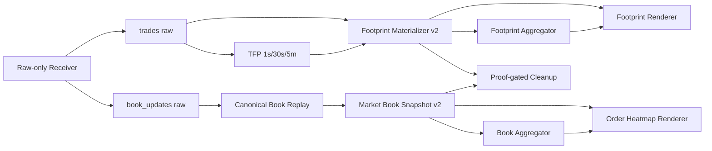

# Agg BTC Footprint / Order Heatmap 後工程仕様

> Status: Proposed
> 作成日: 2026-07-20
> 対象: `/home/weed420/Tool/agg-btc-receiver` と
> `/home/weed420/Tool/tv-footprint-agg-btc`
> 初期対象足: 5分足
> 保存時刻基準: UTC epoch milliseconds
> 本書の MUST / MUST NOT / SHOULD は実装要件を表す。

## 1. 結論

現在のraw受信基盤は、Agg BTC FootprintとOrder Heatmapを作るための
取引・板更新を15市場分記録できている。

ただし、現状のまま全市場を足し合わせることはできない。主な理由は次のとおり。

1. 約定数量は概ねBTC換算済みだが、一部市場の板数量は契約枚数のままである。
2. 既存Python `BookReplay` 経路は、30秒分の更新を全部適用した後の同じ板を
   30個の1秒snapshotとして保存するため、時系列Heatmapにならない。
3. 同経路はsnapshotの置換、sequence gap、cross-block継続を正しく扱う
   正本ではない。
4. 現行Order Heatmapは廃止済みの `data/agg/<market>.parquet` を入力にし、
   価格別板ではなく0–100bpsの粗いring depthを描く旧実装である。
5. Footprintは市場別には作れるが、spot集約・perp集約・全体集約は未実装である。
6. TFP modeのraw cleanupは現在 `trades` だけを対象にしており、
   `book_updates` は増え続ける。
7. 全市場集約に必要な「寄与市場」「欠損市場」「板の取得価格範囲」の証明がない。
8. 一部connectorは内部では初期snapshotを持つが、同期済みsnapshotをrawへ
   出していないため、後工程だけでは初期板を復元できない。

したがって、必要なのは新しい受信サービスではない。既存rawを正本として、
正規化・連続板リプレイ・市場別可視化データ・全市場集約・証拠付き削除を
後工程に追加する。

## 2. 目的

次の4製品を、同じrawから再現可能かつ欠損を隠さない形で生成する。

| 製品 | 入力 | 時間粒度 | 価格粒度 | 主用途 |
|---|---|---:|---:|---|
| 市場別Footprint | trades | 5分 | 保存時$1、描画時可変 | 約定の価格帯別Buy/Sell |
| Agg Footprint | 市場別Footprint | 5分 | 保存時$1、描画時可変 | spot/perp/全市場の約定集約 |
| 市場別Order Heatmap | book_updates | 1秒snapshot | 保存時$1、描画時可変 | 指値流動性の時間推移 |
| Agg Order Heatmap | 市場別板snapshot | 1秒snapshot | 保存時$1、描画時可変 | spot/perpの集約流動性 |

「Agg BTC」は単一の曖昧な合算にしない。初期版では次のproductを分離する。

- `btc_spot_agg`
- `btc_perp_agg`
- `btc_all_agg`

`btc_all_agg` は補助表示とし、分析の既定値はspot/perp分離とする。

## 3. 非目的

初期版では次を実装しない。

- 新しい取引所接続
- receiver内での集約・描画
- ブラウザUI、WebSocket配信、DBサーバー
- spoofing/icebergの断定
- 任意通貨の厳密なFX換算
- raw eventを全市場で一列に並べ替えるグローバルイベントストリーム
- 欠損を0として埋めた「見た目だけ連続」のチャート

## 4. 現況調査

### 4.1 2026-07-20 12:16 JST時点の稼働状態

ユーザーsystemdで次が稼働している。

- `agg-btc-receiver.service`: active
- `agg-btc-receiver-tfp.timer`: active
- `agg-btc-receiver-cleanup-raw.timer`: active

system serviceではなくuser serviceなので、確認には `systemctl --user` を使う。

調査時点の件数は次のとおり。これは瞬間値であり、常駐処理により増加する。

| 対象 | ファイル数 |
|---|---:|
| `data/live_v3/trades` | 456 |
| `data/live_v3/book_updates` | 450 |
| `features_1s` | 261 |
| `book_snapshots` | 0 |
| `footprint_5m` | 0 |

直前に過去データをリセットしているため、最初の完全な連続5分が確定するまでは
`footprint_5m` が0でも異常とは限らない。確定条件を満たさない間はfail closedで
生成しない現在の挙動を維持する。

### 4.2 現在利用できる部品

| 部品 | 判定 | 利用方針 |
|---|---|---|
| `data/live_v3/trades` | 利用可 | 市場別Footprintの正本 |
| `data/live_v3/book_updates` | 利用可 | 市場別板リプレイの正本 |
| TFP 1s/30s/5min | 利用可 | 時間coverageと約定保存則の証明 |
| `tfp_footprint.py` | 利用可・拡張必要 | ロジックを再利用しv2項目を追加 |
| `tv_footprint` renderer | 利用可 | 市場別/Agg両対応へ拡張 |
| JS `BookStateMachine` | 利用可・拡張必要 | canonical replayの正本にする |
| Python `BookReplay` | そのまま本番不可 | 実験用から外し、正本を二重化しない |
| `book_snapshot_writer.py` | schema/commit修正必要 | list-array Parquet形式は再利用 |
| `agg_orderheatmap.py` | 入力・意味とも旧式 | 現行raw由来snapshot consumerへ置換 |

### 4.3 確認できた重大な不足

#### A. 板数量の単位不一致

raw tradeの `qty` は既存connectorで概ねBTC-equivalentへ変換されている。
一方、raw bookの `qty` は市場native unitのままの経路がある。

例:

- OKX BTC-USDT-SWAP: raw板数量はcontract。`qty_btc = contracts × 0.01`
- BitMEX XBTUSD: raw板数量はUSD contract。`qty_btc = contracts / price`
- Binance COIN-M: raw板数量はcontract。`qty_btc = contracts × 100 / price`

したがって、raw `book_updates.qty` を全市場でBTCとみなしてはならない。

#### B. 現行Python snapshot生成が時間を表していない

`scripts/downstream.py` は1ブロックの全book updateを先に適用し、その後に
30個の1秒snapshotを取得している。そのため30個すべてがブロック末尾と同じ状態に
なり得る。また、trade fileが空だとbook更新があってもblock自体を処理しない。

Order Heatmap生成では、book eventだけを独立して時系列順に適用し、
各秒境界でその時点の状態を保存しなければならない。

#### C. replay状態の継続とgap処理が不足

正しい板はmarket-localに継続しなければならない。

- snapshotは既存stateを全置換する
- updateはsnapshot後だけ有効
- sequence gap/crossed book後は無効
- 次の正当なsnapshotまで自動復旧扱いにしない
- process再起動時はdurable checkpointまたはraw snapshotから再開する

既存JS `BookStateMachine` はこの方針に近いが、ブロック間のdurable stateと
Heatmap用full level出力が未接続である。

#### D. raw cleanupが板rawを処理しない

`scripts/cleanup-raw.mjs` のTFP modeは現在 `kinds=['trades']` で走る。
同ファイル内にbook削除判定コードはあるが、このmodeでは到達しない。

`book_updates` を削除するには、Footprint証明ではなく、板snapshot側の
replay/finalization証明を新設する必要がある。

#### E. raw seed snapshotとsequence情報が不足

調査時点のcurrent rawについて `type=snapshot` の有無を確認した結果、
次の6 marketにはsnapshotが1件もなかった。

- `binance_spot`
- `binance_spot_usdc`
- `binance_perp`
- `binance_perp_btcusdc`
- `crypto_com_spot`
- `hyperliquid_perp`

Binanceはconnector内部でREST snapshotとWS diffを同期しているが、同期後の
full stateをrawへemitしていない。Hyperliquidはsourceのl2Bookがfull replace
であるにもかかわらず、rawでは差分 `update` として始まる。

また、現raw envelopeは原則 `seq` 1個だけで、Binanceの `U/u`、
OKXの `prevSeqId/seqId` などのsequence bridge情報を失う。
後工程で単純に `seq == last_seq + 1` を要求すると、正しいrange updateまで
gapとして誤判定する。

従って、book-enabled marketは初回同期・再同期ごとに、後工程が単独で再生できる
full snapshotをrawへ1件出す必要がある。sequence検証に必要なsource metadataも
rawに保持する。

## 5. 全体アーキテクチャ



責務境界は次のとおり。

- receiverはraw記録だけを行う。
- materializerは確定済みの再利用可能なデータ製品を作る。
- aggregatorは確定済み市場別製品だけを合算する。
- rendererは保存済み製品を読むだけで、rawから不足を補完しない。
- cleanupは製品を生成せず、既存のproofを検証してrawを削除する。

## 6. 市場レジストリ

全変換はversioned market registryを参照する。
`config.v3.json` の文字列suffixだけでspot/perpや単位を推測してはならない。

最低限、各marketに次を定義する。

```json
{
  "market": "okx_perp",
  "venue": "okx",
  "instrument_type": "perp",
  "base": "BTC",
  "quote": "USDT",
  "trade_qty_unit": "btc",
  "book_qty_unit": "contract",
  "book_qty_to_btc": "qty_native * 0.01",
  "price_to_usd": "price_native * quote_usd_rate",
  "trade_enabled": true,
  "book_enabled": true,
  "aggregate_required": true,
  "registry_version": "btc_market_registry_v1"
}
```

初期対象は現在enabledの15市場とする。

### 6.1 Spot

- `binance_spot`
- `binance_spot_usdc`
- `bybit_spot`
- `okx_spot`
- `coinbase_spot`
- `kraken_spot`
- `bitstamp_spot`
- `crypto_com_spot`
- `bitfinex_spot`

### 6.2 Perpetual

- `binance_perp`
- `binance_perp_btcusdc`
- `bybit_perp`
- `okx_perp`
- `bitmex_perp`
- `hyperliquid_perp`

### 6.3 capability

Footprintはtradeが取得できる全15市場を対象とする。
Order Heatmapはbook replayの合格試験を通過した市場だけを対象とする。
trade-only市場をHeatmapから除外することは欠損ではなく、registry上の
`book_enabled=false` として明示する。

## 7. 単位正規化契約

### 7.1 共通単位

派生製品では次を正本単位とする。

| 値 | 単位 |
|---|---|
| price | USD-equivalent / BTC |
| qty | BTC-equivalent |
| notional | USD-equivalent |
| time | UTC epoch ms |

基本式:

```text
price_usd   = price_native × quote_usd_rate
qty_btc     = market_registryで定義した変換
notional_usd = price_usd × qty_btc
```

初期v1では `USD=USDT=USDC=1.0` を明示的な固定parityとして使う。
暗黙の1.0にせず、出力へ次を残す。

- `quote_usd_rate`
- `quote_rate_source = fixed_parity_v1`
- `quote_rate_version`

将来oracleへ差し替える場合はschema/config versionを上げ、同じshardを
異なるrateで上書きしない。

### 7.2 raw保持方針

rawはsourceに近い形を維持してよい。ただし派生変換前にregistryで必ず正規化する。
raw schemaには少なくとも次のmetadataを追加する。

- `qty_unit`
- `instrument_type`
- `quote`
- `normalization_version`
- `sequence_policy`
- `seq_start`
- `seq_end`
- `prev_seq`
- `snapshot_origin`

過去rawにmetadataがない場合は、market registry versionをmanifestへ記録して補う。
ただしseed snapshotが存在しない過去windowを、metadataだけで復元済みにしてはならない。

### 7.3 板数量の必須変換

初期registryで少なくとも次をfixture化する。

| market | raw book qty | `qty_btc` |
|---|---|---|
| spot各市場 | BTC | `qty_native` |
| Binance USD-M | BTC | `qty_native` |
| Bybit linear | BTC | `qty_native` |
| OKX BTC-USDT-SWAP | contract | `qty_native × 0.01` |
| BitMEX XBTUSD | USD contract | `qty_native / price_usd` |
| Hyperliquid BTC perp | BTC | `qty_native` |
| Binance COIN-M（将来） | 100 USD contract | `qty_native × 100 / price_usd` |

変換式が未定義のmarketは、数量をそのまま通さずquarantineする。

## 8. 市場別Footprint v2

### 8.1 入力

- `data/live_v3/trades/<market>/<date>/<HH-MM-SS>.jsonl`
- 対応する確定済みTFP `features_1s`
- market registry

### 8.2 bucket

- time bucket: UTC 5分、左閉右開 `[ts, ts+300000)`
- persisted base price bin: `$1`
- `price_bucket = floor(price_usd / 1) × 1`
- 描画時にだけ `$5/$10/$25/...` へcoarsenする
- 細かいbinから粗いbinへの再集約だけを許可し、逆変換しない

これにより、画像の縦幅・表示価格範囲に応じた可変集約を維持しつつ、
保存データを再生成しない。

### 8.3 shard layout

既存互換を維持する。

```text
data/derived/burst_features_v1/
  footprint_5m/<market>/<YYYY-MM-DD>/<HH-MM-SS>.jsonl
```

### 8.4 meta row v2

既存fieldは削除せず、次を追加する。

```json
{
  "type": "meta",
  "schema_version": "market_footprint_5m_v2",
  "ts": 1784517300000,
  "market": "okx_perp",
  "interval_ms": 300000,
  "base_price_bin_usd": 1,
  "open": 64820.0,
  "high": 64910.0,
  "low": 64780.0,
  "close": 64870.0,
  "finalized": true,
  "coverage": 1,
  "source_seconds": 300,
  "source_trade_count": 12345,
  "source_qty_btc": 456.78,
  "source_notional": 29600000.0,
  "source_notional_usd": 29600000.0,
  "source_manifest_hash": "sha256:...",
  "market_registry_version": "btc_market_registry_v1",
  "config_hash": "sha256:...",
  "finalized_at": "..."
}
```

### 8.5 cell row v2

```json
{
  "type": "cell",
  "ts": 1784517300000,
  "market": "okx_perp",
  "price_bucket": 64850,
  "buy_qty_btc": 12.34,
  "sell_qty_btc": 10.10,
  "buy_notional_usd": 800000.0,
  "sell_notional_usd": 655000.0,
  "buy_count": 120,
  "sell_count": 98,
  "total_qty_btc": 22.44,
  "total_notional_usd": 1455000.0,
  "delta_qty_btc": 2.24,
  "delta_notional_usd": 145000.0
}
```

旧consumer用の `buy_notional`, `sell_notional`, `total_notional`,
`delta_notional` とmetaの `source_notional` は移行期間だけaliasとして維持する。

### 8.6 finalization

次をすべて満たすときだけ `finalized=true` にする。

1. 300個の連続した確定済みTFP 1s rowがある。
2. raw trade countとcell count合計が一致する。
3. raw `Σqty_btc` とcell qty合計が許容誤差内で一致する。
4. raw `Σnotional_usd` とcell notional合計が許容誤差内で一致する。
5. sideがbuy/sell以外を含まない。
6. input manifest/config/registry hashが保存される。

## 9. Canonical Book Replay

### 9.1 正本

JS `BookStateMachine` をcanonical replayの唯一の正本とする。
Python `BookReplay` と別々に意味を持たせない。

必要な拡張:

- market registryによるlevel qtyのBTC正規化
- cross-block state継続
- durable checkpoint
- 1秒境界のfull binned snapshot出力
- source coverageとgap/stale metadata
- raw file/hash manifest

stale判定値はmarket registryの `max_book_event_age_ms` で定義し、
初期defaultは5,000msとする。市場特性に応じたoverrideは許可するが、
config hashへ含める。eventが無い秒も直前のvalid stateからsnapshotを作れるが、
ageが閾値を超えた時点で `stale=true` とし、level listを利用不可にする。

### 9.2 event適用順

replayはmarket-localで行い、次の順序を使う。

1. 同一raw file内はappend order
2. raw fileはwindow順
3. `seq` は順序の置換ではなくcontinuity検証
4. 同一timestampでもfile orderを維持

sequence continuityはmarket registryの `sequence_policy` に従う。

| policy | 必須情報 | continuity |
|---|---|---|
| `single_increment` | `seq` | `seq == last_seq + 1` |
| `range_bridge` | `seq_start`, `seq_end` | `seq_start <= last_seq+1 <= seq_end` |
| `prev_bridge` | `prev_seq`, `seq_end` | `prev_seq == last_seq` |
| `checksum` | checksum/source fields | exchange定義のchecksum一致 |
| `unsequenced` | file order | sequenceで欠落証明できない旨をqualityへ残す |

connectorが同期中に検証済みでも、rawへbridge情報を残せるmarketでは残す。
情報がないmarketを `single_increment` と推測しない。

### 9.3 snapshot/update

- `snapshot`: 現在のbid/askを全消去して置換
- `update`: 指定levelをset、qty 0をdelete
- snapshot前のupdate: 利用不可
- sequence gap: そのevent以後を無効化
- crossed book: 無効化
- malformed level: 無効化
- 次の正当なsnapshotでのみ再seed

REST seedは明示的なsourceとして許可するが、WS update適用後に古いREST板を
mergeしてはならない。REST seedは対象updateより前の時点として固定し、
取得時刻・source・hashを残す。

### 9.4 raw seed snapshot

book-enabled connectorは、初回同期と再同期が完了した時点で、内部の同期済み
full bookをrawへ `type=snapshot` として1回emitしなければならない。

- Binance: REST snapshotへbuffered WS diffを適用した同期済みfull state
- Hyperliquid: 最初のfull l2Bookをsnapshot、以後はdiffまたはfull snapshot
- Crypto.com: 最初に完成したfull stateをsnapshot
- sourceがnative snapshotを配るmarket: native snapshotをそのまま利用

snapshot rowには次を含める。

- `snapshot_origin`: `ws_native`, `rest_ws_synced`, `downstream_checkpoint`
- `snapshot_source_ts_ms`
- `snapshot_created_ts_ms`
- `seq_start/seq_end/prev_seq` の利用可能な値
- bid/ask level count
- raw content hash

同期済みsnapshotをrawへ書くことは派生集約ではなく、受信した板を再生可能にする
raw checkpointであり、receiverのraw-only責務に含める。

### 9.5 1秒snapshot

各秒 `S` のsnapshotは、次の条件で作る。

```text
state(S) = event_ts < S の全valid eventを適用した状態
```

つまりstrict pre-secondとし、同じ秒の未来eventを参照しない。
30秒分を先に適用してから過去30秒を複製してはならない。

tradeが0件でもbook updateがあれば処理する。book materializerのcursorを
trade materializerのcursorへ依存させない。

### 9.6 checkpoint

marketごとに次をatomic保存する。

```text
data/derived/burst_features_v1/book_checkpoints/<market>.json
```

内容:

- last committed raw file/path/hash
- last event timestamp
- last sequence
- seeded/gap状態
- full bid/ask stateまたは参照するdurable snapshot
- market registry/config/schema version
- generation

checkpointは一時fileへwrite、fsync、renameする。
再起動時はcheckpointとmanifestの整合を検証し、不一致なら最後の正当な
raw snapshotから再playする。

## 10. 市場別Book Snapshot v2

### 10.1 保存形式

現行の1 row = 1秒、price/qtyをlist列で持つParquet形式を維持する。
price-levelごとのdense rowへ展開しない。

```text
data/derived/burst_features_v1/book_snapshots/
  market=<market>/date=<YYYY-MM-DD>/block-<start>-<content-hash>.parquet
```

### 10.2 schema

| field | type | 意味 |
|---|---|---|
| `ts` | int64 | strict pre-second境界 |
| `schema_version` | string | `market_book_snapshot_1s_v2` |
| `finalized` | bool | raw horizon確定済み |
| `seeded` | bool | 正当なsnapshot後 |
| `gap` | bool | sequence/file gap |
| `crossed` | bool | crossed book検出 |
| `stale` | bool | 最終event age超過 |
| `last_event_ts_ms` | int64/null | 最後に適用したevent |
| `event_age_ms` | int32/null | `ts-last_event_ts` |
| `source_event_count` | int32 | 前秒から適用したevent数 |
| `base_price_bin_usd` | float64 | 初期値1 |
| `best_bid`, `best_ask`, `mid` | float64/null | BTC USD-equivalent |
| `bid_prices`, `ask_prices` | list<float64> | $1 bucket |
| `bid_qtys_btc`, `ask_qtys_btc` | list<float64> | BTC-equivalent |
| `bid_notional_usd`, `ask_notional_usd` | list<float64> | USD-equivalent |
| `bid_coverage_min` | float64/null | 取得済みbid下限 |
| `ask_coverage_max` | float64/null | 取得済みask上限 |
| `source_manifest_hash` | string | raw proof |
| `registry_version` | string | 単位変換proof |

`seeded=false` または `gap/crossed/stale=true` のrowは値を0埋めせず、
level listを空にしてqualityで理由を示す。

### 10.3 coverage

板にlevelが無いことと、feedがその価格まで取得できていないことを区別する。

- `bid_coverage_min <= price < best_bid` の範囲内でlevelなし: 0として扱える
- `price < bid_coverage_min`: unknown
- `best_ask < price <= ask_coverage_max` の範囲内でlevelなし: 0として扱える
- `price > ask_coverage_max`: unknown

Agg Heatmapではunknown marketをそのprice cellの分母へ含めない。

### 10.4 commit

- Parquetはtemp pathへ書き、fsync後にrenameする。
- filename hashはtimestamp集合だけでなく、schema/config/source/contentを含む。
- 同じtimestampで内容が違うfileを「既存なので成功」としてskipしない。
- finalized shardはimmutableとし、同一proofでのみrecoverする。

## 11. Agg Footprint

### 11.1 入力

同一5分・同一base binのfinalized市場別Footprint v2だけを読む。
raw tradeを再度直接15市場mergeしない。

### 11.2 集約

product registryが持つmarket setに対し、次を合計する。

```text
buy_qty_btc       = Σ market.buy_qty_btc
sell_qty_btc      = Σ market.sell_qty_btc
buy_notional_usd  = Σ market.buy_notional_usd
sell_notional_usd = Σ market.sell_notional_usd
buy_count         = Σ market.buy_count
sell_count        = Σ market.sell_count
```

cellごとに0取引のmarketは0でよいが、5分shard自体が欠損したmarketを0扱いしない。

### 11.3 Agg価格ローソク

全市場のraw OHLCを単純にmin/maxして1本にしない。
各1秒について次のaggregate VWAPを作り、その1秒系列から5分OHLCを作る。

```text
agg_price_1s = Σnotional_usd / Σqty_btc
open  = 最初のvalid agg_price_1s
high  = max(valid agg_price_1s)
low   = min(valid agg_price_1s)
close = 最後のvalid agg_price_1s
```

spot/perpで別々に計算する。`btc_all_agg` も同式だが補助表示とする。

### 11.4 出力

```text
data/derived/agg_visual_v1/
  footprint_5m/product=<product>/date=<YYYY-MM-DD>/<HH-MM-SS>.jsonl
  manifests/footprint_5m/<product>.json
```

metaへ必ず次を含める。

- `product`
- `required_markets`
- `contributors`
- `missing_markets`
- `contributor_count`
- `market_set_version`
- `source_shard_hashes`
- `finalized`
- `coverage`

strict productではrequired marketが1つでも欠けたらfinalizeしない。
将来degraded productを作る場合は別product IDにし、strict出力を上書きしない。

## 12. Agg Order Heatmap

### 12.1 入力

同じUTC secondのfinalized市場別Book Snapshot v2を使う。

### 12.2 集約規則

productの対象marketについて、同じ$1 price bucketを合計する。

```text
bid_qty_btc(price)       = Σ valid_market.bid_qty_btc(price)
ask_qty_btc(price)       = Σ valid_market.ask_qty_btc(price)
bid_notional_usd(price)  = Σ valid_market.bid_notional_usd(price)
ask_notional_usd(price)  = Σ valid_market.ask_notional_usd(price)
```

各cellに次を持つ。

- `contributor_count`
- `eligible_market_count`
- `coverage_ratio`
- `carried_market_count`

初期版はsnapshotの時間補間をしない。同じ秒のsnapshotが無ければ欠損とする。
将来last observation carryを使う場合は最大2秒まで、`carried=true` を必須とし、
strict productとは別config hashにする。

### 12.3 finalization

1秒snapshotを確定する条件:

1. 対象marketのraw horizonが閉じている。
2. 各required marketがseededかつgap/crossed/staleなし。
3. registry versionが一致する。
4. base price binが一致する。
5. source snapshot hashが揃う。

全required marketが揃わない秒はstrict Agg snapshotを生成しない。
描画側はその秒をgapとして表示する。

### 12.4 出力

```text
data/derived/agg_visual_v1/
  orderheatmap_1s/product=<product>/date=<YYYY-MM-DD>/
    block-<start>-<content-hash>.parquet
  manifests/orderheatmap_1s/<product>.json
```

list-array列を使い、各秒のprice/qty/notional/contributor_countをparallel listで持つ。

## 13. 描画仕様

### 13.1 共通

rendererはfinalized製品だけを読む。
raw fallback、部分shard、旧 `data/agg` fallbackは禁止する。

表示期間の既定値:

- 5分足
- 24時間
- Footprintは画面幅に応じて表示本数を調整可能
- Order Heatmapは1秒dataを画面pixel幅へdownsample可能

### 13.2 可変価格集約幅

保存binは$1固定、描画binは次で決める。

```text
visible_price_span / drawable_row_count
```

候補を `$1, $2, $5, $10, $25, $50, $100, $250, $500` から
切り上げ選択する。描画領域の縦pixel数、cell font、最低行高を考慮する。
同じ画像内では全candle/全snapshotで同じ描画binを使う。

### 13.3 Footprint

- candle OHLC
- price cell内のBuy/Sell notional
- delta
- POC
- imbalance強調
- product/market、時刻、bin幅、寄与市場数、coverageを表示

### 13.4 Order Heatmap

- x軸: time
- y軸: absolute BTC price
- bid/ask liquidityを色分け
- aggregate価格candleまたはmid lineを重ねる
- unknown coverageを透明または斜線で表示
- 0 liquidityとmissingを同じ黒で潰さない
- color scaleはp95/p99 clipを選べるが、元値を変更しない
- market/Agg product、寄与市場数、stale/gapを表示

旧 `agg_orderheatmap.py` のbps ring表示は診断用として別名に残すか削除し、
本製品のOrder Heatmapとは呼ばない。

## 14. raw retention / 自動削除

### 14.1 trades

trade rawは次をすべて満たした30秒blockだけ削除可能。

1. TFP 1s/30s/5m proofがcommitted
2. 対応5分の市場別Footprint v2がfinalized
3. count/qty/notional保存則が成立
4. safety margin経過
5. outputとmanifestがdurable

Agg製品は市場別rawの完全な代替ではないため、trade raw削除の必須proofにはしない。
市場別Footprintが正本の再集約元になる。

### 14.2 book_updates

book rawは次をすべて満たした30秒blockだけ削除可能。

1. 対象30秒の30個の市場別Book Snapshot v2がfinalized
2. snapshotのsource manifestが対象raw file/hashを含む
3. replayがseededでgap/crossed/staleなし
4. 次回再起動に必要なdurable checkpoint/full snapshotが、削除対象より後にある
5. safety margin経過
6. checkpointから最新rawまでのreplay試験に成功

初期seedや復旧に必要なraw snapshotを先に削除してはならない。

### 14.3 cleanup実装

cleanupはkindごとにproof verifierを分離する。

- `verifyTradeRetentionProof`
- `verifyBookRetentionProof`

TFP modeで `trades` しか走査しない現状を修正し、
book proof完成後にだけ `book_updates` を対象へ追加する。
proof未実装の間は現在どおりbook rawを保持する。

削除ログへ次を出す。

- path
- kind
- raw hash
- proof manifest path/hash
- deleted_at
- dry-run/actual
- skip reason

## 15. systemd運用

推奨順序:

```text
receiver
  ├─ TFP materialize
  ├─ market Footprint materialize
  ├─ market Book Snapshot materialize
  ├─ Agg materialize
  ├─ chart render
  └─ proof-gated cleanup
```

実装するuser unit:

- `agg-btc-receiver-book-materialize.service`
- `agg-btc-receiver-book-materialize.timer`
- `agg-btc-receiver-visual-aggregate.service`
- `agg-btc-receiver-visual-aggregate.timer`
- 必要なら `agg-btc-receiver-chart-render.service`

既存receiver/TFP/cleanupは維持する。
unitの `WorkingDirectory` は `/home/weed420/Tool/...` に統一し、
旧 `/home/weed420/dev/github/...` を残さない。

materializerの同時実行は同じoutput root lockで排他する。
cleanupはmaterializer lock取得中に走らない。

## 16. 監視項目

market/productごとに次を機械可読で出す。

- raw latest event age
- TFP latest finalized second/5min
- Footprint latest finalized 5min
- Book latest finalized second
- replay seeded/gap/crossed/stale
- required/contributor/missing market
- materializer lag
- raw bytes
- derived bytes
- cleanup deleted/skipped count
- skip reason別件数
- last successful manifest hash

異常条件:

- receiverはrunningだがraw ageが閾値超過
- tradeは進むがFootprintが15分以上進まない
- book rawは進むがBook Snapshotが2分以上進まない
- strict aggregateが15分以上進まない
- cleanupが24時間以上0件かつrawが増加
- qty/notional保存則不一致
- registry未定義market出現

## 17. 実装タスク

### P0: データを壊さないための必須作業

1. versioned market registryを追加する。
2. 全enabled connectorのtrade/book qty unit fixtureを作る。
3. raw book envelopeへsource sequence range/previous sequenceを追加する。
4. 全book-enabled connectorが同期・再同期時にfull snapshotをrawへ出す。
5. book level正規化をcanonical adapterへ追加する。
6. JS `BookStateMachine` をcross-block durable replayへ接続する。
7. strict pre-secondのBook Snapshot v2 writerを実装する。
8. snapshot replace、gap、crossed、restart recoveryを試験する。
9. current Python snapshot経路を本番から外す。
10. Footprintをv2へ拡張しqty/schema/hashを保存する。
11. Footprint materializerをreceiver側の安定した後工程へ配置する。
   renderer repoはconsumerに限定する。

### P1: 市場別製品

12. 市場別Footprint v2を全15市場で生成する。
13. book-capable市場のBook Snapshot v2を生成する。
14. `tv-footprint-agg-btc` をmarket/product入力へ対応させる。
15. `agg_orderheatmap.py` をBook Snapshot v2入力へ置換する。
16. 市場別Footprint/Heatmapの24時間画像を生成する。

### P2: Agg製品

17. `btc_spot_agg` Footprintを実装する。
18. `btc_perp_agg` Footprintを実装する。
19. `btc_all_agg` Footprintを補助製品として実装する。
20. spot/perp Agg Order Heatmapを実装する。
21. contributor/coverage/missing表示をrendererへ追加する。
22. aggregate manifestとcontent hashを実装する。

### P3: retentionと常駐

23. book retention proofを実装する。
24. `book_updates` cleanupをdry-runで24時間検証する。
25. user systemd unitをrepoへ追加・installする。
26. status/lag/bytesを確認する検証scriptを追加する。
27. 実削除を有効化し、削除後replay不可能にならないことを確認する。

## 18. テスト仕様

### 18.1 unit

- OKX 100 contracts at $65,000 → 1 BTC
- BitMEX 65,000 contracts at $65,000 → 1 BTC
- Binance COIN-M 650 contracts at $65,000 → 1 BTC
- spot/linear 1.25 qty → 1.25 BTC
- snapshotで旧levelが完全消去される
- qty 0でlevelが削除される
- Binance `U/u` range bridgeを単純な+1判定でrejectしない
- OKX `prevSeqId/seqId` bridge不一致をrejectする
- unsequenced marketをsequencedとして偽装しない
- 初回同期・再同期ごとに再生可能なraw snapshotが1件以上ある
- gap後は次snapshotまで無効
- crossed bookは出力不可
- 同一秒のeventをその秒のstrict pre-stateへ混ぜない
- no-trade/book-update-only blockでもsnapshotが作られる
- sparse coverage外を0にしない

### 18.2 conservation

市場別Footprint:

```text
Σcell.count        == raw trade count
Σcell.qty_btc      ~= Σraw normalized qty
Σcell.notional_usd ~= Σraw normalized notional
```

Agg Footprint:

```text
agg cell == Σrequired market cell
agg total == Σrequired market shard total
```

市場別Book:

- fixture event列の各秒stateと期待levelが一致
- writer読戻し後もlist長とprice/qty対応が一致
- content hash再計算が一致

Agg Book:

- 各priceのqty/notionalが市場別合計と一致
- contributor countがcoverage fixtureと一致
- missing required market時にstrict snapshotが生成されない

### 18.3 restart/idempotency

- materializerを同じrawへ2回実行して同じhashになる
- commit途中kill後にtempだけが残り、finalizedを偽装しない
- checkpoint直後restartで重複・欠落がない
- manifestとoutput不一致時はfail closed
- finalized outputを異なるconfigで上書きしない

### 18.4 retention

- proofなしtrade rawを削除しない
- Footprint v1だけでv2必須rawを削除しない
- Book Snapshot proofなしbook rawを削除しない
- seed snapshotを参照中は削除しない
- dry-runとactualの対象集合が一致する
- 削除後にcheckpoint + 残存rawから最新stateを再構築できる

### 18.5 実データ最終試験

連続24時間について次を満たす。

1. enabled 15市場のtrade coverageを集計する。
2. 全市場Footprint保存則error 0。
3. book対象市場でgap/stale/crossed率を報告する。
4. market snapshotとrawをランダム100秒で独立照合する。
5. spot/perp Agg合計を市場別出力から再計算し一致する。
6. 5分足24時間のFootprint画像とOrder Heatmap画像を生成する。
7. missingを0にしていないことを視覚・数値で確認する。
8. cleanup dry-run対象を確認後、限定windowで実削除する。
9. 削除後restart/replay試験に成功する。

## 19. 合格条件

次をすべて満たした時点で「Agg BTC Footprint / Order Heatmap完成」とする。

- receiverのraw-only責務を変更していない。
- trade/book両方の単位がregistryで定義・検証されている。
- 市場別Footprint v2が全15市場で生成できる。
- Book Snapshot v2がstrict event-timeで生成できる。
- spot/perp Agg Footprintがfinalized proof付きで生成できる。
- spot/perp Agg Order Heatmapがcoverage付きで生成できる。
- 5分足24時間画像に不自然な時間gapがない。
- 実際のgapは欠損として表示され、0取引/0板と区別できる。
- trade/book rawの削除がそれぞれ対応proofにより保護される。
- 24時間実データ試験、restart試験、限定削除試験が全合格する。

## 20. 実装上の決定事項

本仕様では次を確定事項とする。

1. 新receiverは作らない。
2. 保存binは$1、描画binは画面に応じて粗くする。
3. spot/perpを既定で分離する。
4. absolute volume/notionalを合計し、恣意的なvenue weightは使わない。
5. missingを0埋めしない。
6. canonical book replayを一つにする。
7. raw削除はtrade proofとbook proofを分離する。
8. rendererはrawを直接補完しない。
9. strict aggregateとdegraded aggregateを同じproductへ混ぜない。
10. 実装はP0から順に進め、Book Snapshot proof完成前に
    `book_updates` 自動削除を有効化しない。
